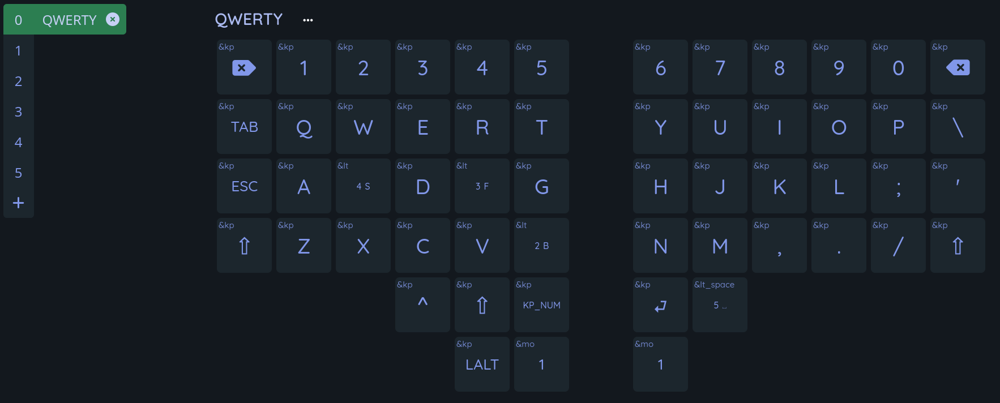
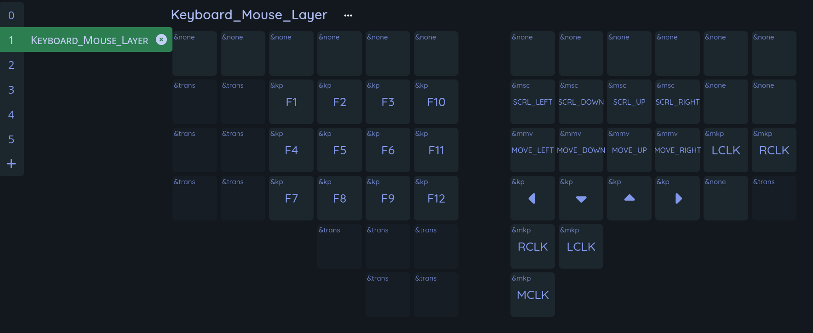
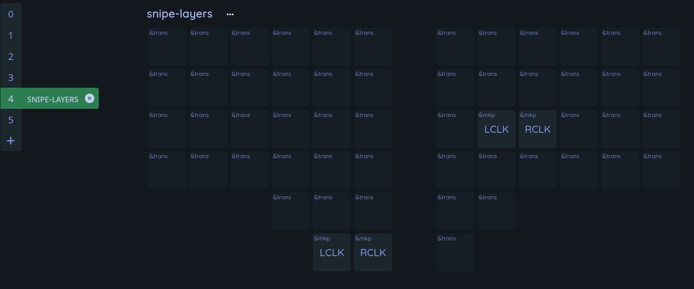
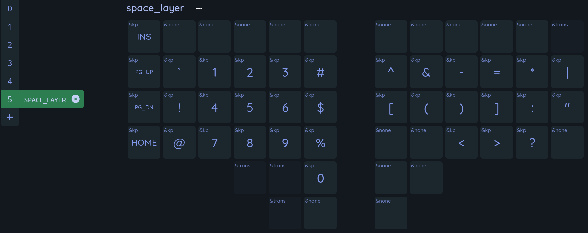

weekin 的模板自带 build 工作流，每次 commit 之后只需要下载它自动构建的 firmware 就好了

下面是我改了几天得到的最适合我的配置结果

## lt_space

在 [balanced flavor](https://zmk.dev/docs/keymaps/behaviors/hold-tap#interrupt-flavors) 的基础上加了一个 [retro-tap](https://zmk.dev/docs/keymaps/behaviors/hold-tap#retro-tap) 属性

这是我目前发现最合适的放在空格上的 layer/tap 设置

## 键盘布局

第二层是蓝牙层

第三层是轨迹球的 scroll layer 

都没有进行改动

